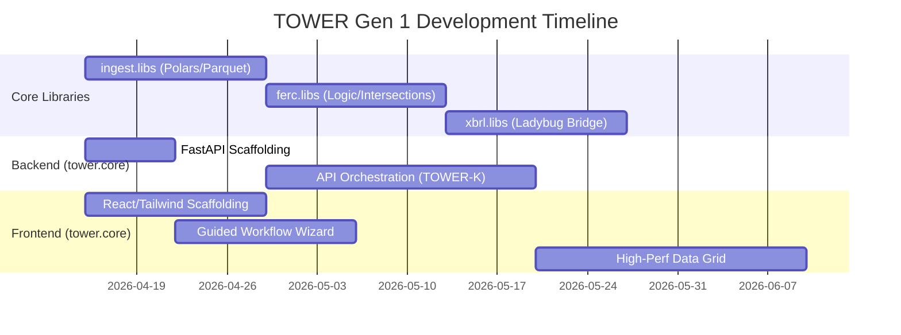

# TOWER Core Gen 1: Project Plan & Implementation Phasing (000103)

## Executive Summary
This document outlines the granular project plan for **TOWER Core (Gen 1): Mechanical Excellence & Reliability**. Following the updated architectural directives, the **backend orchestration layer** will be powered exclusively by a high-performance **Python / FastAPI** stack, while the **frontend** will be built using **React and Tailwind CSS**. 

The core objective is to deliver a "Zero-Hiccup" compliance filing environment powered by the TOWER-K ingestion engine. The data layer will utilize **Polars** for high-speed columnar manipulation, **Ladybug** for validation, and native **Parquet** generation for persistent, memory-mapped state management.

---

## 1. Front-End MVP: React & Tailwind CSS (`tower.core/apps/frontend`)

The user interface will be entirely decoupled from the backend serving layer. It will be built as a high-performance SPA (Single Page Application).

### Stage 1: Core Scaffolding & Design System (Weeks 1-2)
*   **Action**: Initialize the React application and configure Tailwind CSS.
*   **Deliverables**:
    *   Implement the "Industrial-Clean" Tailwind design tokens (monospaced fonts, rigorous layouts, technical blue accents).
    *   Setup React Router, authentication state management, and the primary Workspace Dashboard.
    *   Develop reusable base React components (Buttons, Modals, Status Indicators).

### Stage 2: The "Young Filer" Guided Workflow (Weeks 3-4)
*   **Action**: Build the step-by-step UI wizard to demystify FERC forms.
*   **Deliverables**:
    *   State-managed React onboarding wizard for Form 1 and Form 714.
    *   Dynamic Q&A interface mapping user inputs to underlying schema nodes without exposing raw XBRL complexity.
    *   Drag-and-drop document upload interface communicating directly with the FastAPI endpoints.

### Stage 3: High-Performance Data Grid & Continuous Validation (Weeks 5-8)
*   **Action**: Implement the heavy data-visualization components.
*   **Deliverables**:
    *   Virtual-scrolling React data table capable of rendering massive datasets served from the Polars/Parquet backend.
    *   "Pre-Audit Shield" UI: A real-time scorecard displaying missing links, calculation inconsistencies, and Ladybug validation warnings.

---

## 2. API Backbone & TOWER-K Ingestion (`tower.core/apps/api` & `tower.core/apps/backend` & `ingest.libs`)

The API layer acts as the orchestrator, built on **Python/FastAPI**, while **TOWER-K** forms the functional data ingestion and processing core located in `ingest.libs`, using **Polars** and **Parquet**.

### Phase 2.1: FastAPI Orchestration
*   **Action**: Structure the asynchronous API.
*   **Deliverables**:
    *   RESTful/WebSocket endpoints in FastAPI catering to the React frontend.
    *   Handle user sessions, workspace isolation, and task queue orchestration.

### Phase 2.2: Data Standardization (TOWER-K Ingest)
*   **Module**: `lib_tower_k_ingest` (Python/Polars)
*   **Functionality**:
    *   Eagerly stream large Excel/CSV trade logs via FastAPI uploads.
    *   Execute high-performance vectorized operations via **Polars** to sanitize fields (date normalization, string anomaly stripping).
    *   **Parquet Generation**: Serialize incoming datasets immediately into Parquet files, acting as a robust, low-memory columnar-DB snapshot and the "source of truth."

### Phase 2.3: Mapping & The Application of Rules
*   **Module**: `ferc.libs` Integration
*   **Functionality**:
    *   Map the standardized Polars dataframes to the FERC Form 1/714 taxonomy structure.
    *   Execute hardcoded regulatory intersection rules against the columnar data.

### Phase 2.4: Ladybug Engine Validation & Output
*   **Module**: `xbrl.libs` (Ladybug Core)
*   **Functionality**:
    *   Pass the fully mapped structural graph representations to the Ladybug engine.
    *   Execute hyper-fast structural validations across the taxonomy graph.
    *   Generate a structured "Error Graph" to be routed back through FastAPI to the React UI.
    *   Finalize and export identical XBRL-CSV outputs ready for regulatory submission.

---

## 3. Reusable Cross-Workspace Library Integrations (`*.libs`)

A critical architectural principle of the TOWER framework is that `tower.core` is strictly an application consumer. It does not contain domain business logic; instead, it imports specialized, reusable capabilities from adjacent `*.libs` directories within the `TOWER_WORKSPACE`.

### 3.1 `TOWER_WORKSPACE/ingest.libs` (Data Ingestion & Sanitization)
The `tower.core/apps/backend` relies on this directory for foundational data parsing, explicitly decoupled from any XBRL specifications:
*   **`lib_tower_k_ingest`**: The dedicated Python library wrapping **Polars**. Responsible for all heavy-lifting columnar data extraction from raw CSV/XLSX into memory, and writing out optimal **Parquet** state files. 

### 3.2 `TOWER_WORKSPACE/xbrl.libs` (XBRL Core Processing)
This directory handles operations strictly tied to the XBRL specification and graph modeling:
*   **`lib_xbrl_ladybug_bridge`**: Handles the ingestion and production of xbrl-cv from ladybug sources.

### 3.3 `TOWER_WORKSPACE/ferc.libs` (Domain-Specific Rules)
Once data is standardized by `ingest.libs`, the `tower.core/apps/backend` orchestrates validation by passing the columnar data to this directory:
*   **`lib_ferc_rules`**: Isolated Python business logic dictating the specific arithmetic, intersection, and cross-validation rules for FERC Form 1/714 reporting.

### 3.4 `TOWER_WORKSPACE/agent.libs` (Gen 3 Cognitive Automation)
While Gen 1 focuses on mechanical reliability, the backend architecture is designed to integrate seamlessly with the TOWER-S agent modules located here:
*   **`lib_tower_s_forensics`**: Built strictly as a reusable module, it will eventually sit alongside the validation pipeline to handle automated semantic reconciliation and detect structural taxonomy drift natively via the Polars datasets.

### 3.5 Internal `tower.core` Application Modules
Only the components specific to the web application's routing, orchestration, and UI presentation stay inside `tower.core`:
*   **`lib_ui_industrial`** (`tower.core/apps/frontend/components`): The React component library defining the "Industrial-Clean" visual language using Tailwind CSS.
*   **`lib_tower_api`** (`tower.core/apps/api`): The FastAPI layer managing websocket connections, user sessions, REST endpoints, and coordinating requests to the external `*.libs`.

---

## 4. Gantt-like Dependency Roadmap & Critical Path

The development of Gen 1 follows a "Standardized-First" dependency model. Core ingestion libraries must reach a stable parity before the API can serve the high-performance data grids required by the React frontend.

### 4.1 Dependency Breakdown

1.  **Stage 1 (Foundation): `ingest.libs` & `tower.core` Scaffolding**
    *   **Dependency**: None.
    *   **Focus**: Establishing the Polars ingestion pipeline and React/FastAPI boilerplate. Without the Parquet serialization from `ingest.libs`, no subsequent data-heavy features can be built.
2.  **Stage 2 (Logic): `ferc.libs` & API Integration**
    *   **Dependency**: `ingest.libs`.
    *   **Focus**: Applying domain intersections to the standardized data frames. The FastAPI layer begins to orchestrate the flow from raw file -> `ingest.libs` -> `ferc.libs`.
3.  **Stage 3 (Validation): `xbrl.libs` & UI Wizard**
    *   **Dependency**: `ferc.libs`.
    *   **Focus**: Ferrying mapped data into the Ladybug engine via the bridge. The UI Wizard (React) handles the "Stage 2" logic input collection.
4.  **Stage 4 (Performance): High-Perf Data Grid & MVP Finalization**
    *   **Dependency**: Full API Orchestration (Stage 2/3 complete).
    *   **Focus**: Connecting the React Data Grid to the optimized Parquet/Polars backend streams. This represents the "Mechanical Excellence" milestone.

---
*Status: Architecture Re-alignment | Target: TOWER Core MVP (React/Tailwind + Python/FastAPI/Polars focus)*
